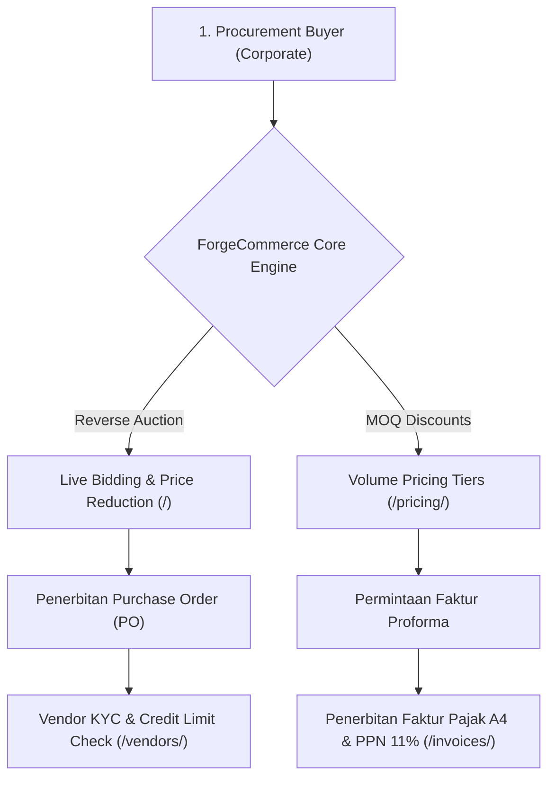

# 📦 ForgeCommerce OS — Enterprise B2B Wholesale & RFQ Engine
### Titan #12 of the 50 Sovereign Enterprise Fleet (`olyxmintabansos-byte`)

---

## 💎 Overview
**ForgeCommerce OS** adalah sistem operasi pengadaan dan perdagangan grosir B2B (*Business-to-Business*) kelas korporasi yang dirancang dengan arsitektur *client-side local-first*. Platform ini mengintegrasikan **Mekanisme Lelang Terbalik (Reverse Auction RFQ)**, **Matriks Harga Skala Kuantitas (Tiered Volume Pricing MOQ)**, **Sistem Penilaian Risiko Kredit Rekanan (Vendor KYC & Credit Scoring)**, serta **Generator Faktur Pajak B2B & Proforma Resmi Berformat Cetak A4**.

---

## 🚀 Fitur Unggulan (4 Rute 100% Live)

1. **RFQ Reverse Auction & Bidding Command (`/`)**:
   - Pasar pengadaan komoditas industri (Baja, Semikonduktor, Kimia Resin, Solar PV).
   - Mekanisme lelang terbalik: vendor rekanan bersaing menurunkan harga per satuan unit hingga batas waktu lelang.
   - Pemenang tender mengunci pesanan (*Award PO*) dengan 1 klik.
2. **Wholesale Volume Pricing Matrix (`/pricing/`)**:
   - Perhitungan diskon kuantitas bertingkat (Tier 1 s/d Tier 4 hingga potongan 22.8%).
   - Slider kuantitas interaktif mengkalkulasi subtotal dan PPN 11% secara instan.
3. **Vendor KYC & Credit Scoring Engine (`/vendors/`)**:
   - Pemeringkatan kredit model Dun & Bradstreet (AAA hingga CCC) berbasis skor aktuarial (300 - 850).
   - Pengukur utilisasi plafon kredit, estimasi risiko gagal bayar, dan metrik ketepatan pengiriman SLA.
4. **Official B2B Proforma & Tax Invoice A4 (`/invoices/`)**:
   - Lembar faktur proforma dan pajak resmi berstandar korporasi dengan format A4 pixel-perfect (`window.print()`).
   - Rincian NPWP penjual dan pembeli, nomor seri faktur, PPN 11%, dan stempel otorisasi pajak.

---

## 🏗️ Diagram Arsitektur Sistem

---

## 🌐 Rute Live Produksi
- **RFQ Reverse Auction:** [https://olyxmintabansos-byte.github.io/forgecommerce-os/](https://olyxmintabansos-byte.github.io/forgecommerce-os/)
- **Volume Pricing Matrix:** [https://olyxmintabansos-byte.github.io/forgecommerce-os/pricing/](https://olyxmintabansos-byte.github.io/forgecommerce-os/pricing/)
- **Vendor KYC & Scoring:** [https://olyxmintabansos-byte.github.io/forgecommerce-os/vendors/](https://olyxmintabansos-byte.github.io/forgecommerce-os/vendors/)
- **Proforma & Tax Invoices:** [https://olyxmintabansos-byte.github.io/forgecommerce-os/invoices/](https://olyxmintabansos-byte.github.io/forgecommerce-os/invoices/)

---

*Architected by Antigravity Chief Systems Architect • Executed by Hermes Agent Desktop • Sovereign Fleet for `olyxmintabansos-byte`*
